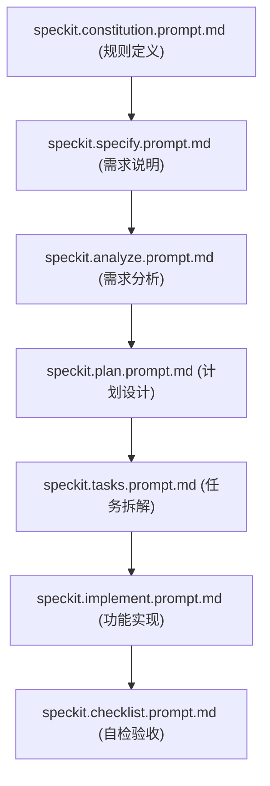

非常棒——你已经正确地理解了 **Spec-Kit** 的初始化逻辑和工作流。
下面我帮你系统、逐层地解释这两个部分：

---

## 🧩 一、`.github/prompts/` 下的文件作用

> 每个 `speckit.*.prompt.md` 都是与 LLM（通常是 GPT）交互的“提示模板（prompt templates）”，它们定义了不同阶段中 AI 应该如何思考和输出内容。
> Spec-Kit 把项目开发拆成多个阶段，让 AI 有清晰的“项目生命周期”概念。

| 文件名                                  | 阶段/角色          | 说明                                                                                                   |
| :----------------------------------- | :------------- | :--------------------------------------------------------------------------------------------------- |
| **`speckit.constitution.prompt.md`** | 🏛️ 项目宪章 / 规则集 | 是整个项目的“最高准则”。它定义了项目规范、约束、沟通规则、格式要求等。比如代码风格、命名规范、AI 回答语气、输出格式等。 👉 类似于为 AI 团队写的“公司章程”。             |
| **`speckit.specify.prompt.md`**      | 🎯 需求定义        | 用来引导 AI 从自然语言描述中明确需求，生成清晰的 *specification*（功能规格文档）。 用户输入的是「我想做一个什么项目」，AI 依据此 prompt 把模糊的描述转成正式需求。 |
| **`speckit.analyze.prompt.md`**      | 🔍 分析阶段        | 在 specification 生成后，用于深入分析需求的可行性、依赖关系、系统结构、潜在风险等。 👉 相当于架构师对需求文档的技术分析。                            |
| **`speckit.clarify.prompt.md`**      | 💬 需求澄清        | 当需求含糊或缺信息时，这个 prompt 用于让 AI 主动询问用户、澄清问题。 👉 让 AI 不再“自己脑补”，而是主动追问。                                 |
| **`speckit.plan.prompt.md`**         | 🗺️ 技术计划       | 根据已确认的 specification，生成一个详细的“实现计划（plan.md）”，包括技术栈、文件结构、模块职责、优先级等。                                    |
| **`speckit.tasks.prompt.md`**        | ✅ 任务分解         | 把 plan 进一步细化为“任务清单（tasks.md）”，包含每个开发步骤、命令、文件、代码块说明等。 👉 对应人类项目管理的 *Sprint Tasks / Backlog items*。 |
| **`speckit.implement.prompt.md`**    | 🧱 实现阶段        | 根据 `tasks.md`，指导 AI 逐步实现具体功能（写代码、测试、部署脚本等）。 👉 是 AI 的“执行层”。                                       |
| **`speckit.checklist.prompt.md`**    | 🧾 验收/自检清单     | 定义完成后 AI 应该进行的自检标准，如“是否符合规范”、“是否满足需求”、“是否存在潜在问题”。 👉 类似 QA 测试或 Code Review 阶段。                    |

🧠 **总结一句话：**

> `.github/prompts` 是 Spec-Kit 的「思维模板系统」，把开发流程拆解为 **规则（constitution）→ 需求（specify）→ 分析（analyze）→ 澄清（clarify）→ 计划（plan）→ 任务（tasks）→ 实现（implement）→ 检查（checklist）** 八个阶段。

---

## 🧱 二、`.specify/` 目录结构解释

> 这个目录存放的是 **本地执行逻辑（脚本）** 和 **文档模板（生成物的样板）**，让这些 prompt 真正落地。

### 1️⃣ `memory/constitution.md`

* 实际是存储项目的“记忆文件”，记录从 `speckit.constitution.prompt.md` 生成的项目规则或之前 AI 的学习上下文。
* AI 每次执行任务时会引用这里的内容，保持一致的风格和上下文。

---

### 2️⃣ `scripts/powershell/*.ps1`

这些是帮助你快速执行不同阶段命令的 PowerShell 脚本。

| 文件名                            | 作用                                                                             |
| :----------------------------- | :----------------------------------------------------------------------------- |
| **`check-prerequisites.ps1`**  | 检查运行 Spec-Kit 所需依赖（Node、uvx、Git、Python等）是否满足。                                  |
| **`common.ps1`**               | 公共函数库，被其他脚本调用。定义通用命令、变量、输出格式。                                                  |
| **`create-new-feature.ps1`**   | 自动化创建新功能分支或新 feature 文件的流程（比如新页面或新模块）。                                         |
| **`setup-plan.ps1`**           | 初始化项目计划文件（`plan.md`），根据当前 specification 自动生成。                                  |
| **`update-agent-context.ps1`** | 更新 AI 的上下文环境，比如同步 `.specify/memory` 和 `.github/prompts` 的最新内容，让 LLM 保持项目的当前状态。 |

💡这些脚本可以配合 `uvx specify ...` 命令使用，让整个 AI 工作流自动化。

---

### 3️⃣ `templates/*.md`

模板文件，用于生成最终文档（spec、plan、tasks、checklist等）。
AI 在执行各阶段时，会把生成的内容填入这些模板中。

| 模板文件                         | 输出目标         | 内容结构                 |
| :--------------------------- | :----------- | :------------------- |
| **`agent-file-template.md`** | 定义 AI 代理配置文件 | 说明该 AI 的角色、职责、上下文信息。 |
| **`checklist-template.md`**  | 用于生成 QA 检查清单 | 列出验收条件、自检问题。         |
| **`plan-template.md`**       | 用于生成项目计划     | 包括时间线、架构图、模块说明等。     |
| **`spec-template.md`**       | 用于生成需求规格说明   | 结构化描述功能需求、约束、接口等。    |
| **`tasks-template.md`**      | 用于生成任务清单     | 按顺序列出执行步骤、命令和文件。     |

---

## ⚙️ 三、整体执行逻辑（帮助你理解 workflow）

每一步生成的内容会保存到 `.specify/templates` 的对应模板中或项目根目录下的实际文件（例如 `plan.md`, `tasks.md`）。
这就是为什么你可以通过 `/speckit.plan`、`/speckit.tasks` 等命令一步步推进项目的原因。

---

## 📚 举个实际例子（对照你的截图）

| 你执行的命令                  | 背后触发的 prompt                   | 输出文件                              | 功能        |
| :---------------------- | :----------------------------- | :-------------------------------- | :-------- |
| `/speckit.constitution` | speckit.constitution.prompt.md | `.specify/memory/constitution.md` | 初始化规则     |
| `/speckit.specify`      | speckit.specify.prompt.md      | `spec.md`                         | 明确需求      |
| `/speckit.plan`         | speckit.plan.prompt.md         | `plan.md`                         | 生成技术方案    |
| `/speckit.tasks`        | speckit.tasks.prompt.md        | `tasks.md`                        | 生成可执行任务步骤 |
| `/speckit.implement`    | speckit.implement.prompt.md    | 实际代码/配置                           | 执行实现      |
| `/speckit.checklist`    | speckit.checklist.prompt.md    | checklist.md                      | 检查是否完成    |

---

如果你愿意，我可以帮你画一张「Spec-Kit 文件与职责关系图（知识脑图式）」或是一个「从命令到输出文件的完整流程图」，你想看哪种？
