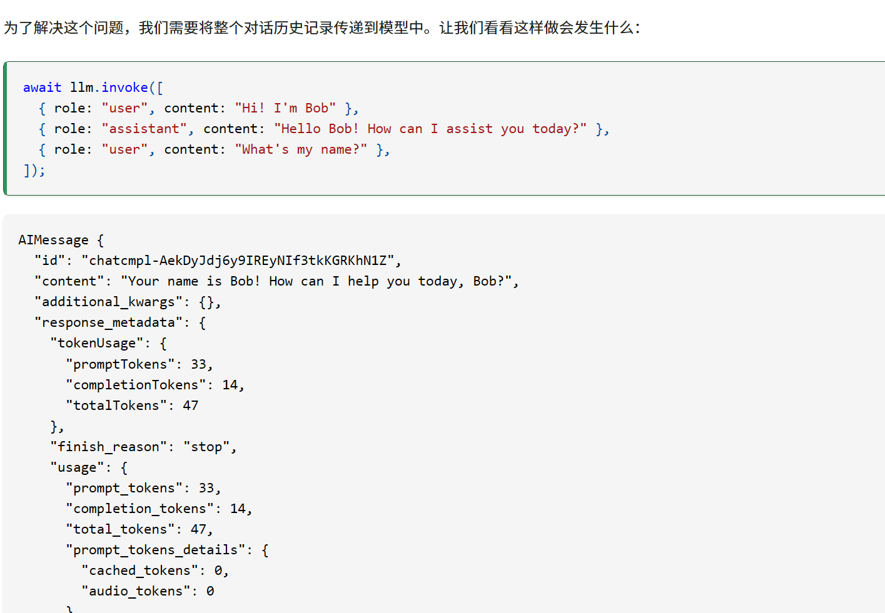
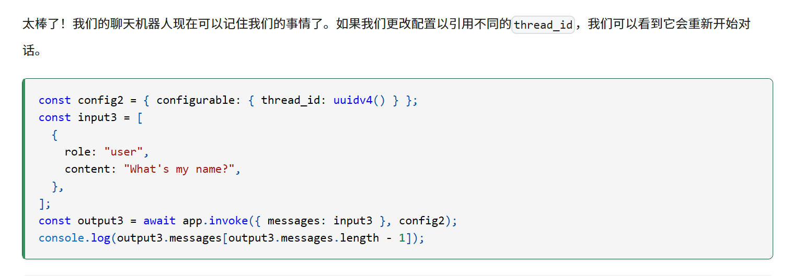
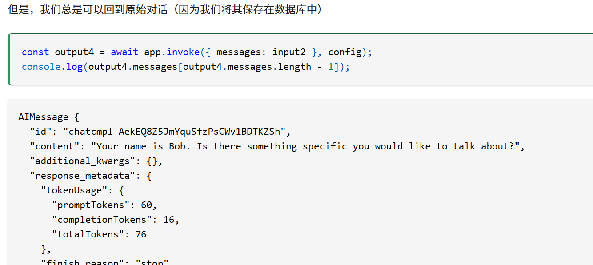
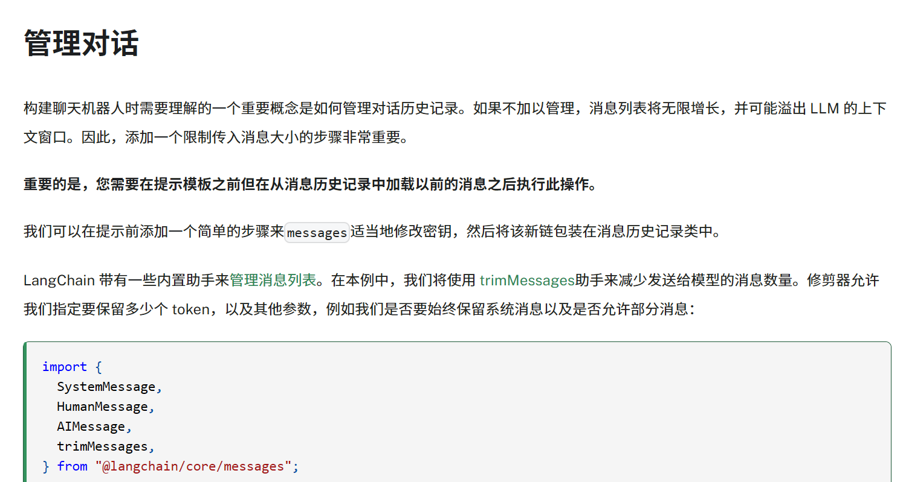

<h1 align="center">LangSmith</h1>

# 1. [deepseek](https://js.langchain.com/docs/integrations/chat/deepseek/)

```sh
npm i @langchain/core @langchain/langgraph uuid
npm i @langchain/deepseek @langchain/core
```

```env
process.env.LANGSMITH_TRACING = "true";
process.env.LANGSMITH_API_KEY = "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";
```

## 常规的代码，无法做到保存会话，为了解决这个问题，将会话历史传到模型中

```js
import { ChatDeepSeek } from "@langchain/deepseek";
import dotenv from "dotenv";
dotenv.config();
const llm = new ChatDeepSeek({
  apiKey: process.env.DEEPSEEK_API,
  model: "deepseek-chat",
  temperature: 0,
  // other params...
});
const aiMsg = await llm.invoke([
  [
    "system",
    "You are a helpful assistant that translates English to French. Translate the user sentence.",
  ],
  ["human", "I love programming."],
]);
aiMsg;
console.log(aiMsg.content);
```



## `LangGraph`内置了一个包装功能，实现了上下文对话的功能

```js
import { ChatDeepSeek } from "@langchain/deepseek";
import dotenv from "dotenv";
import {
  START,
  END,
  MessagesAnnotation,
  StateGraph,
  MemorySaver,
} from "@langchain/langgraph";
import { v4 as uuidv4 } from "uuid";
dotenv.config();
const llm = new ChatDeepSeek({
  apiKey: process.env.DEEPSEEK_API,
  model: "deepseek-chat",
  temperature: 0,
  // other params...
});
// Define the function that calls the model
const callModel = async (state) => {
  const response = await llm.invoke(state.messages);
  return { messages: response };
};

// Define a new graph
const workflow = new StateGraph(MessagesAnnotation)
  // Define the node and edge
  .addNode("model", callModel)
  .addEdge(START, "model")
  .addEdge("model", END);

// Add memory
const memory = new MemorySaver();
const app = workflow.compile({ checkpointer: memory });

const config = { configurable: { thread_id: uuidv4() } };

const input = [
  {
    role: "user",
    content: "Hi! I'm Bob.",
  },
];
const output = await app.invoke({ messages: input }, config);
// The output contains all messages in the state.
// This will log the last message in the conversation.
console.log(output.messages[output.messages.length - 1]);

const input2 = [
  {
    role: "user",
    content: "What's my name?",
  },
];
const output2 = await app.invoke({ messages: input2 }, config);
console.log(output2.messages[output2.messages.length - 1]);
```

# 2. 通过更改 config 可以实现切换会话



## 切换回原 config 返回原来会话



# 3. 管理会话长度（后面学）


