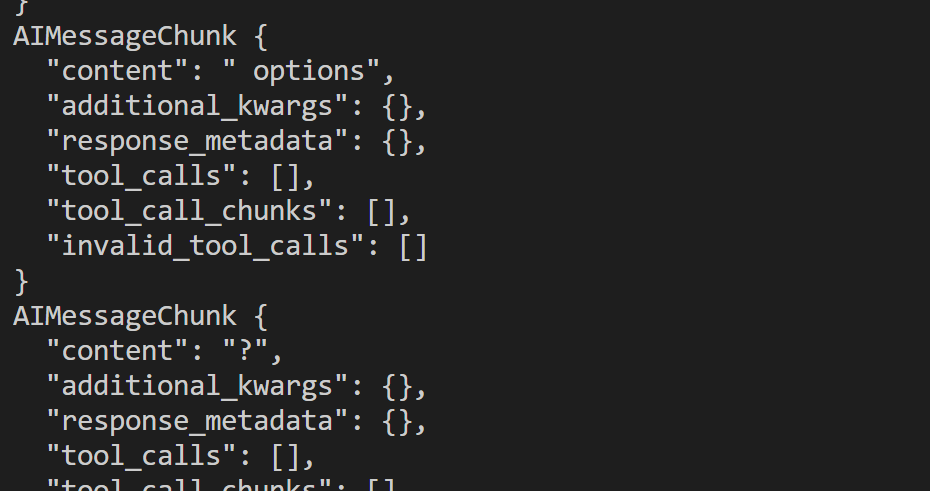
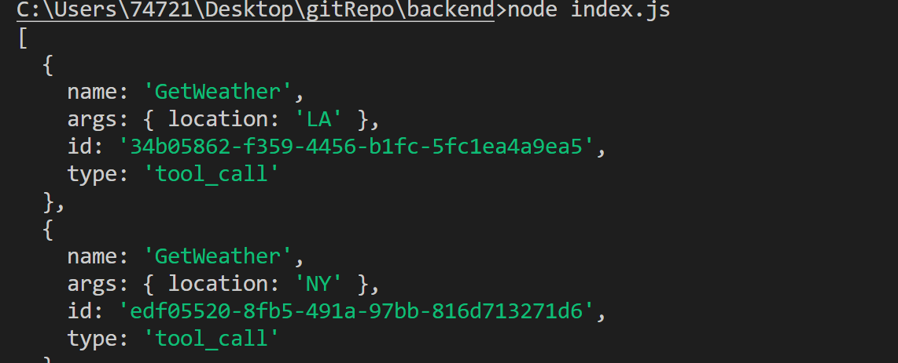
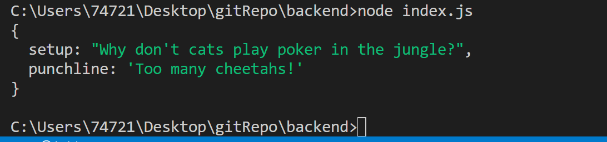
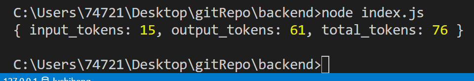

<h1 align="center">Lanchain+ollama学习</h1>

[官方](https://v03.api.js.langchain.com/classes/_langchain_ollama.ChatOllama.html)

```sh
git init
git checkout -b LangChain
git remote add origin git@github.com:lushiheng123/AI_Study.git
git add .
git commit -m "first commit"
git status
git push -u origin LangChain
```

# 1. 安装环境

npm install langchain

# 2. 用`ChatOllama`和`invoke`

```js
import { ChatOllama } from "@langchain/ollama";

const llm = new ChatOllama({
  model: "gemma3:4b",
  temperature: 0,
  // other params...
});
const input = `Translate "I love programming" into French.`;

// Models also accept a list of chat messages or a formatted prompt
const result = await llm.invoke(input);
console.log(result);
```

### 效果，出结果


# 2. 一个 chunk 一个 chunk 的回答，就是使用流式传输提供更好的体验，不用等所有答案一起出来再输出

### 可以看到每个 chunk 包含他的内容（分词）



```js
import { ChatOllama } from "@langchain/ollama";

const llm = new ChatOllama({
  model: "gemma3:4b",
  temperature: 0,
  // other params...
});
const input = `Translate "I love programming" into French.`;

for await (const chunk of await llm.stream(input)) {
  console.log(chunk);
}
```

# 3. 工具绑定：用 `bindTools` 让 LLM 调用外部功能。

> ### 结构化数据：用 Zod 定义工具参数。

> ### 异步调用：用 invoke 获取模型响应。

> ### 本地模型：用 Ollama 运行 Mistral。

> ### 智能分解：让 LLM 解析复杂问题并生成 tool_calls

```js
import { ChatOllama } from "@langchain/ollama";
import { z } from "zod";
const llm = new ChatOllama({
  model: "mistral:latest",
  temperature: 0,
  // other params...
});

const GetWeather = {
  name: "GetWeather",
  description: "Get the current weather in a given location",
  schema: z.object({
    location: z.string().describe("The city and state, e.g. San Francisco, CA"),
  }),
};

const GetPopulation = {
  name: "GetPopulation",
  description: "Get the current population in a given location",
  schema: z.object({
    location: z.string().describe("The city and state, e.g. San Francisco, CA"),
  }),
};

const llmWithTools = llm.bindTools([GetWeather, GetPopulation]);
const aiMsg = await llmWithTools.invoke(
  "Which city is hotter today and which is bigger: LA or NY?"
);
console.log(aiMsg.tool_calls);
```



# 4. `withStructuredOutput`结合`zod`库结构化输出

```js
import { ChatOllama } from "@langchain/ollama";
import { z } from "zod";
const llm = new ChatOllama({
  model: "mistral:latest",
  temperature: 0,
  // other params...
});

const Joke = z
  .object({
    setup: z.string().describe("The setup of the joke"),
    punchline: z.string().describe("The punchline to the joke"),
    rating: z
      .number()
      .optional()
      .describe("How funny the joke is, from 1 to 10"),
  })
  .describe("Joke to tell user.");

const structuredLlm = llm.withStructuredOutput(Joke, { name: "Joke" });
const jokeResult = await structuredLlm.invoke("Tell me a joke about cats");
console.log(jokeResult);
```



# 5. usage_metadata 显示耗 token 数量

```js
import { ChatOllama } from "@langchain/ollama";

const llm = new ChatOllama({
  model: "mistral:latest",
  temperature: 0,
  // other params...
});
const input = `Translate "I love programming" into French.`;
const aiMsgForMetadata = await llm.invoke(input);
console.log(aiMsgForMetadata.usage_metadata);
```


