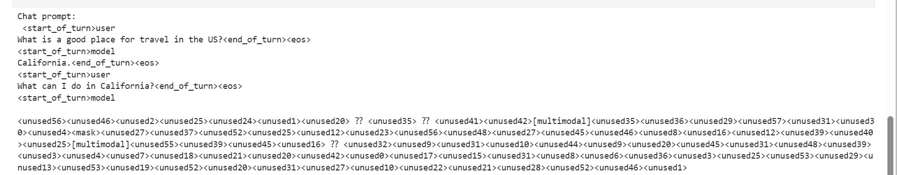

<h1 align="center">谷歌Gemma模型学习</h1>

# 这里我们选择 pytorch+docker 的方式，模型是`gemma3-4b-pt`

```sh
git init
git checkout -b gemma
git remote add origin git@github.com:lushiheng123/AI_Study.git
git add .
git commit -m "first commit"
git status
git push -u origin gemma
```

# 1. `安装模型`，启用 `docker`,启用`jupyter notebook`,`git clone`仓库

### 下载模型[kaggle 超链接](https://www.kaggle.com/models/google/gemma-3/pyTorch/gemma-3-4b-pt)

```py
import kagglehub

# Download latest version
path = kagglehub.model_download("google/gemma-3/pyTorch/gemma-3-4b-pt")

print("Path to model files:", path)
```

### 启用 docker 上的容器

```sh
docker run --gpus all -it -v ~/Python-AI:/workspace -p 8888:8888
```

### 进入一个终端`docker exec -it a9508a01dbf5 sh`

```sh
pip install jupyter
jupyter notebook --ip=0.0.0.0 --port=8888 --allow-root --NotebookApp.token=''
```

### 下载 gemma 的 git 仓库`git clone https://github.com/google/gemma_pytorch.git`

### 然后在带有`setup.py`的文件下`pip install .`

# 2. 记住我们下载的模型有`tokenizer.model`和`model.ckpt`

```py
import os
# Ensure that the tokenizer is present
tokenizer_path = os.path.join("/models/gemma-3-4b-pt/1", 'tokenizer.model')
assert os.path.isfile(tokenizer_path), 'Tokenizer not found!'
# Ensure that the checkpoint is present
ckpt_path = os.path.join("/models/gemma-3-4b-pt/1", f'model.ckpt')
assert os.path.isfile(ckpt_path), 'PyTorch checkpoint not found!'
import sys
from gemma.config import GemmaConfig, get_model_config
from gemma.model import GemmaForCausalLM
from gemma.tokenizer import Tokenizer
import contextlib
import os
import torch
from gemma.config import GemmaConfig, get_model_config
model_config = get_model_config("4b")
model_config.tokenizer = tokenizer_path
# Instantiate the model and load the weights.
torch.set_default_dtype(model_config.get_dtype())
device = torch.device("cuda")
model = GemmaForCausalLM(model_config)
model.load_weights(ckpt_path)
model = model.to(device).eval()
# Generate with one request in chat mode

# Chat templates
USER_CHAT_TEMPLATE = "<start_of_turn>user\n{prompt}<end_of_turn><eos>\n"
MODEL_CHAT_TEMPLATE = "<start_of_turn>model\n{prompt}<end_of_turn><eos>\n"

# Sample formatted prompt
prompt = (
    USER_CHAT_TEMPLATE.format(
        prompt='What is a good place for travel in the US?'
    )
    + MODEL_CHAT_TEMPLATE.format(prompt='California.')
    + USER_CHAT_TEMPLATE.format(prompt='What can I do in California?')
    + '<start_of_turn>model\n'
)
print('Chat prompt:\n', prompt)

output_ids = model.generate(
    USER_CHAT_TEMPLATE.format(prompt=prompt),
    device=device,
    output_len=128,
)
decoded_text = model.tokenizer.decode(output_ids)
print(decoded_text)
```


