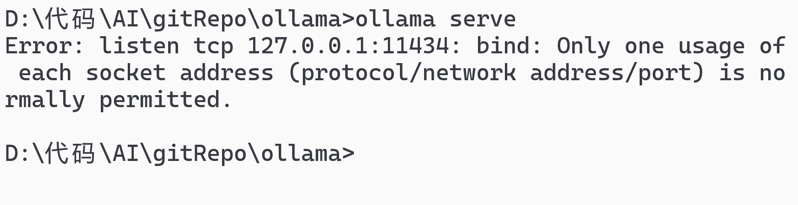
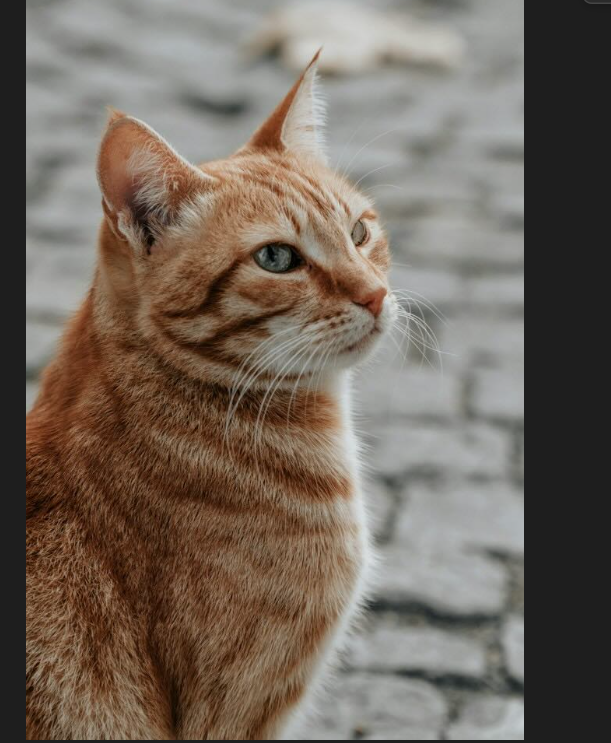
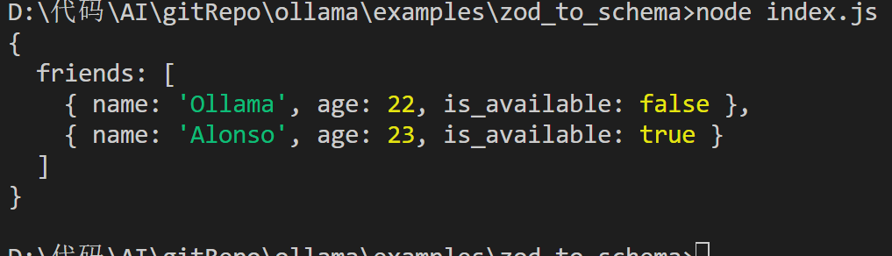
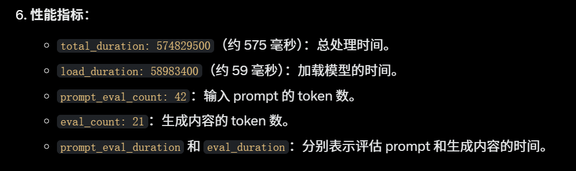

<h1 align = "center">ollama笔记</h1>

# 可以先看具体的项目

### [ollama 本地后端](/examples/local_ollama/README.md)

```sh
git init
git checkout -b ollama
git remote add origin git@github.com:lushiheng123/AI_Study.git
git add .
git commit -m "first commit"
git status
git push -u origin ollama
```

# 目录

- [ollama serve 看端口](#ollama-serve-看端口)
- 简单介绍
  - [generate 中参数 params 的讲解](#7-generate-中的参数)
  - [ollama.list()遍历模型](#1-环境配一下npm-install-ollama必须要的)
  - [ollama.generate()](#3-ollamarequest和ollamagenerate的区别)
  - [deepseek-coder-v2 生成代码](#4-ollamagenerate使用deepseek-coder-v2模型提供-api-可以补全代码)
  - [llava 处理图片](#5-llava-模型可以处理图片因为他是多模态-multimodal-和视觉模型可以处理图片)
  - [ollama.chat](#6-ollamachat提供参数和格式输出特定格式的结果)
- API
  - [chat](/examples/API/Chat/README.md)
  - [generate]
  - [pull]
  - [push]
  - [create]
  - [delete]
  - [copy]
  - [list]
  - [show]
  - [mebed]
  - [ps]
  - [abort]
  -

---

# 1. 环境配一下，`npm install ollama`必须要的

# ollama serve 看端口



# 2. `ollama.list()`查看本地部署的模型，注意是异步处理

```js
import ollama from "ollama";

ollama
  .list()
  .then((models) => {
    console.log(models); // 打印模型列表
  })
  .catch((error) => {
    console.error("Error fetching model list:", error);
  });
```

### 或者代码可以写成

```js
import ollama from "ollama";

const model_list = async () => {
  try {
    const models = await ollama.list();
    console.log(models); // 打印模型列表
  } catch (error) {
    console.error("Error fetching model list:", error);
  }
};

model_list();
```

### `node index.js`运行


# 3. `ollama.request`和`ollama.generate`的区别？


### `ollama.generate`的例子,用于`文本`，默认`非流式传输`,调参`stream：true`设置为流式传输

```js
import ollama from "ollama";

const response = await ollama.generate({
  model: "mistral:latest",
  prompt: "What is the capital of France?",
});

console.log(response.response); // "Paris"
```


# 4. `ollama.generate`使用`deepseek-coder-v2`模型提供 API 可以补全代码

### prompt: "def add(" 提供了函数定义的开头。suffix: "return c" 暗示函数应该以 return c 结束（c 可能是函数的返回值，比如两个数的和）。模型会尝试生成中间部分，比如函数参数和逻辑，使整个代码从 def add( 到 return c 连贯。

```js
import ollama from "ollama";

const main = async () => {
  try {
    const response = await ollama.generate({
      model: "deepseek-coder-v2",
      prompt: `def add(`,
      suffix: `return c`,
    });
    console.log(response.response);
  } catch (error) {
    console.log(error);
  }
};

main();
```


# 5. llava 模型可以处理图片，因为他是多模态 Multimodal 和视觉模型，可以处理图片

```js
import ollama from "ollama";
const main = async () => {
  try {
    const imagePath = "cat.jpg";
    const response = await ollama.generate({
      model: "llava:latest",
      prompt: "describe this image:",
      images: [imagePath],
      stream: true,
    });
    for await (const part of response) {
      process.stdout.write(part.response);
    }
  } catch (err) {
    console.log(err);
  }
};

main();
```




# 6. `ollama.chat`提供参数和格式输出特定格式的结果

[ollama.chat](./examples/zod_to_schema/index.js)


# 7. generate 中的参数

```js
import ollama from "ollama";

const translateSentence = async () => {
  try {
    const aiMsg = await ollama.generate({
      //模型可以切换，都一样，deepseek思考时间长
      model: "deepseek-r1:8b",
      prompt:
        "You are a helpful assistant that translates English to Chinese. Translate this sentence: 'I love programming.'",
      temperature: 0.7,
      maxRetries: 2,
    });
    console.log(aiMsg); // 只打印翻译结果
  } catch (error) {
    console.error("Error translating sentence:", error);
  }
};

translateSentence();
```

## `temperature: 0.7`控制生成文本的随机性，0.7 是一个适中的值，既不过于保守（接近 0）也不过于随机（接近 1）。

## `maxRetries: 2`，如果请求失败，最多重试 2 次

## 返回参数`response`，代表回答，可以用 ollama.generate().response 来直接返回文本回答结果

## 返回参数`context`模型内部`token`

## 返回性能指标


