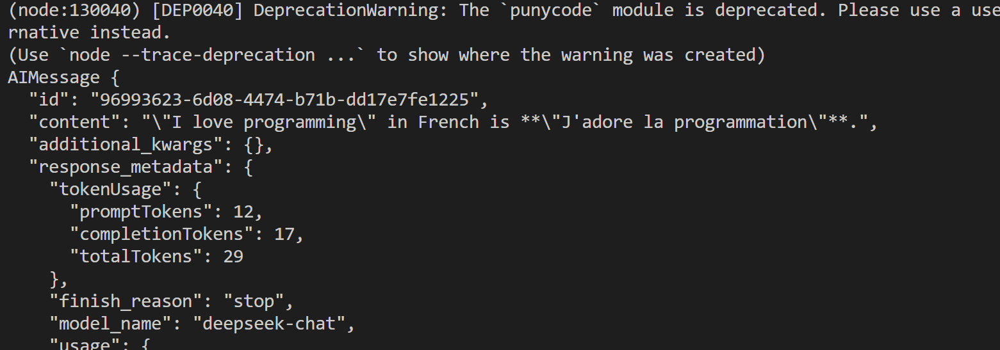

# LLM 语言模型层

# 目录

- [deepseek](./deepseek/index.js)

# 1. `@langchain/deepseek`，有两个模型 chat/reasoner

```js
import { ChatDeepSeek } from "@langchain/deepseek";
import dotenv from "dotenv";
dotenv.config();
const llm = new ChatDeepSeek({
  model: "deepseek-chat",
  //  model: "deepseek-reasoner",
  temperature: 0,
  apiKey: process.env.DEEPSEEK_API,
  // other params...
});

const input = `Translate "I love programming" into French.`;

// Models also accept a list of chat messages or a formatted prompt
const result = await llm.invoke(input);
console.log(result);
```



# 2. `chunk` 分片流式输出

```js
import { ChatDeepSeek } from "@langchain/deepseek";
import dotenv from "dotenv";
dotenv.config();
const llm = new ChatDeepSeek({
  model: "deepseek-chat",
  //  model: "deepseek-reasoner",
  temperature: 0,
  apiKey: process.env.DEEPSEEK_API,
  // other params...
});

const input = `Translate "I love programming" into French.`;

for await (const chunk of await llm.stream(input)) {
  console.log(chunk);
}
```
