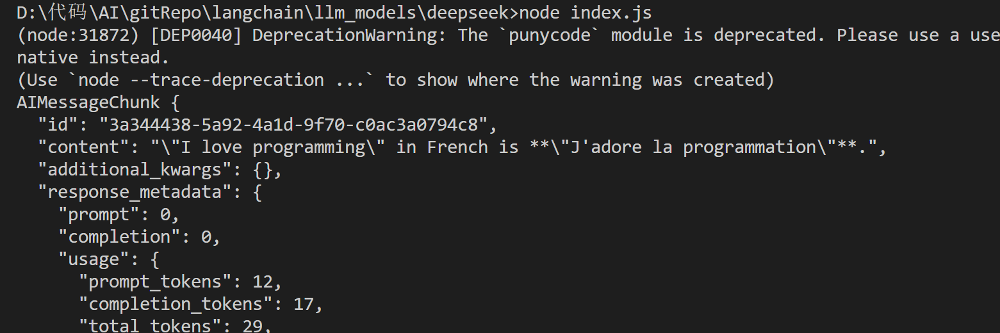
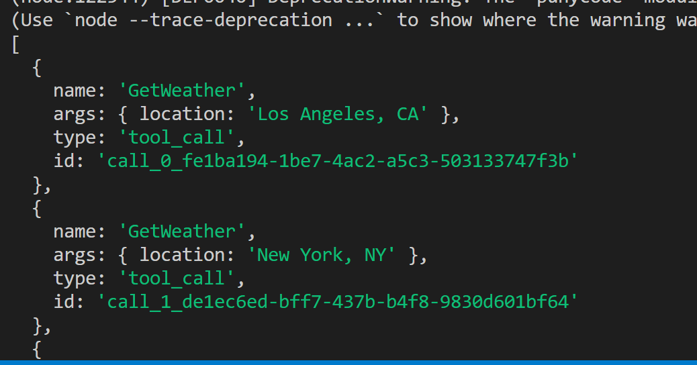
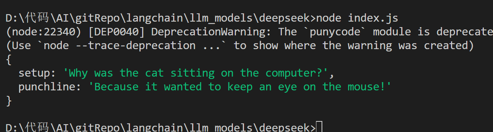

# LLM 语言模型层

# 目录

- [deepseek](./deepseek/index.js)

# 1. `@langchain/deepseek`，有两个模型 chat/reasoner

```js
import { ChatDeepSeek } from "@langchain/deepseek";
import dotenv from "dotenv";
dotenv.config();
const llm = new ChatDeepSeek({
  model: "deepseek-chat",
  //  model: "deepseek-reasoner",
  temperature: 0,
  apiKey: process.env.DEEPSEEK_API,
  // other params...
});

const input = `Translate "I love programming" into French.`;

// Models also accept a list of chat messages or a formatted prompt
const result = await llm.invoke(input);
console.log(result);
```


# 2. `chunk` 分片流式输出

```js
import { ChatDeepSeek } from "@langchain/deepseek";
import dotenv from "dotenv";
dotenv.config();
const llm = new ChatDeepSeek({
  model: "deepseek-chat",
  //  model: "deepseek-reasoner",
  temperature: 0,
  apiKey: process.env.DEEPSEEK_API,
  // other params...
});

const input = `Translate "I love programming" into French.`;

for await (const chunk of await llm.stream(input)) {
  console.log(chunk);
}
```

# 3. 使用 concat 处理一下 chunk 流式输出的结果

```js
import { ChatDeepSeek } from "@langchain/deepseek";
import dotenv from "dotenv";
import { concat } from "@langchain/core/utils/stream";

dotenv.config();
const llm = new ChatDeepSeek({
  model: "deepseek-chat",
  //  model: "deepseek-reasoner",
  temperature: 0,
  apiKey: process.env.DEEPSEEK_API,
  // other params...
});
const input = `Translate "I love programming" into French.`;

const stream = await llm.stream(input);
let full;
for await (const chunk of stream) {
  full = !full ? chunk : concat(full, chunk);
}
console.log(full);
```



# 4. `bindTools`

```js
import { ChatDeepSeek } from "@langchain/deepseek";
import dotenv from "dotenv";
import { z } from "zod";

dotenv.config();
const llmForToolCalling = new ChatDeepSeek({
  model: "deepseek-chat",
  //  model: "deepseek-reasoner",
  temperature: 0,
  apiKey: process.env.DEEPSEEK_API,
  // other params...
});
const GetWeather = {
  name: "GetWeather",
  description: "Get the current weather in a given location",
  schema: z.object({
    location: z.string().describe("The city and state, e.g. San Francisco, CA"),
  }),
};

const GetPopulation = {
  name: "GetPopulation",
  description: "Get the current population in a given location",
  schema: z.object({
    location: z.string().describe("The city and state, e.g. San Francisco, CA"),
  }),
};

const llmWithTools = llmForToolCalling.bindTools([GetWeather, GetPopulation]);
const aiMsg = await llmWithTools.invoke(
  "Which city is hotter today and which is bigger: LA or NY?"
);
console.log(aiMsg.tool_calls);
```



# 5. 结构化输出

```js
import { ChatDeepSeek } from "@langchain/deepseek";
import dotenv from "dotenv";
import { z } from "zod";

dotenv.config();
const llmForToolCalling = new ChatDeepSeek({
  model: "deepseek-chat",
  //  model: "deepseek-reasoner",
  temperature: 0,
  apiKey: process.env.DEEPSEEK_API,
  // other params...
});
const Joke = z
  .object({
    setup: z.string().describe("The setup of the joke"),
    punchline: z.string().describe("The punchline to the joke"),
    rating: z
      .number()
      .optional()
      .describe("How funny the joke is, from 1 to 10"),
  })
  .describe("Joke to tell user.");

const structuredLlm = llmForToolCalling.withStructuredOutput(Joke, {
  name: "Joke",
});
const jokeResult = await structuredLlm.invoke("Tell me a joke about cats");
console.log(jokeResult);
```


