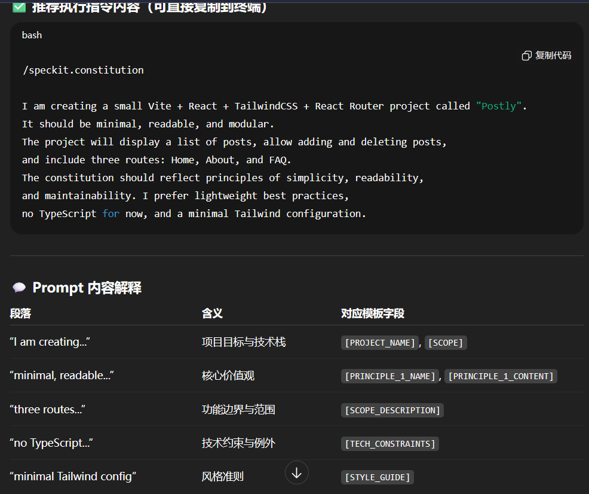
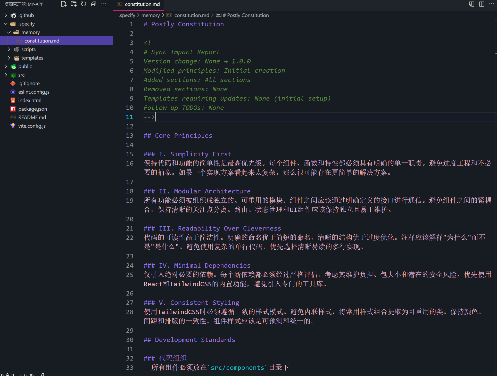

```sh 
/speckit.constitution

I am creating a small Vite + React + TailwindCSS + React Router project called "Postly".
It should be minimal, readable, and modular. 
The project will display a list of posts, allow adding and deleting posts, 
and include three routes: Home, About, and FAQ. 
The constitution should reflect principles of simplicity, readability, 
and maintainability. I prefer lightweight best practices, 
no TypeScript for now, and a minimal Tailwind configuration.
```

# 执行完后的内容
