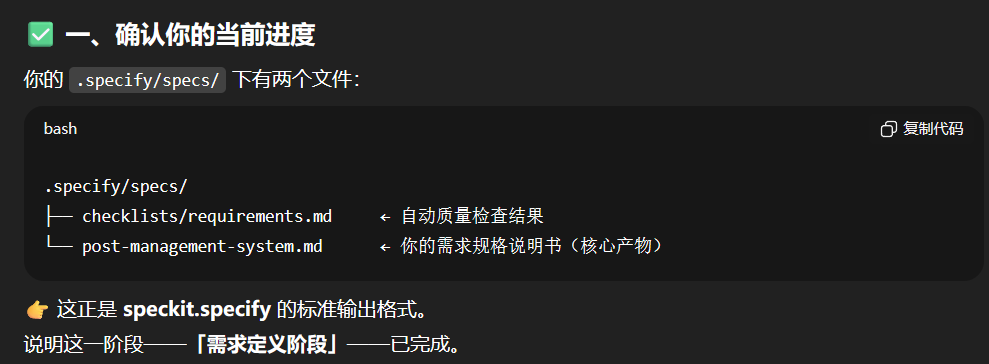
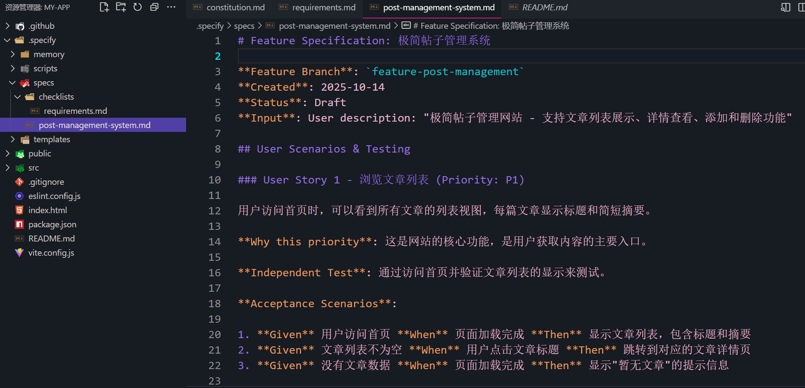

```md
请按照 speckit.specify.prompt.md 中的说明操作。

我正在使用 **Vite + React + TailwindCSS + React Router** 构建一个**极简前端项目**。

目标是创建一个**简单的帖子管理网站**。

### 核心功能
- 在首页 (`/`) 显示文章列表
- 每篇文章显示其标题和简短摘要
- `/post/[title]` 显示文章详情
- `/about` 介绍项目
- `/faq` 提供常见问题和解答
- 允许**添加**和**删除文章**（仅模拟数据，无后端）

### 技术栈
- Vite
- React 18+
- TailwindCSS
- React Router v6+
- 无后端，所有数据模拟在内存或 JSON 中

### 约束
- 保持简洁明了
- 使用与《章程》一致的模块化结构（src/components、src/routes、src/utils 等）
- 遵循 TailwindCSS 规范以保持一致性
- 仅使用函数式组件（不使用类组件）

请创建**规范文档**，定义所有路由、主要组件和数据结构。
```

# 产出specs/post-management-system.md

# 产出specs/checklists/requirements.md
```markdown
# Specification Quality Checklist: 极简帖子管理系统

**Purpose**: 验证规范的完整性和质量
**Created**: 2025-10-14
**Feature**: [极简帖子管理系统规范文档](../post-management-system.md)

## Content Quality

- [x] 无实现细节（未指定具体的语言、框架、API）
- [x] 专注于用户价值和业务需求
- [x] 适合非技术相关者阅读
- [x] 所有必需章节已完成

## Requirement Completeness

- [ ] 仍有1个需要澄清的标记（FR-007关于数据持久化方式）
- [x] 需求是可测试和明确的
- [x] 成功标准是可衡量的
- [x] 成功标准与技术无关（没有实现细节）
- [x] 所有验收场景已定义
- [x] 已识别边缘情况
- [x] 范围明确界定
- [x] 已识别依赖和假设

## Feature Readiness

- [x] 所有功能需求都有明确的验收标准
- [x] 用户场景涵盖主要流程
- [x] 功能满足成功标准中定义的可衡量成果
- [x] 规范中没有实现细节泄漏

## Notes

需要明确的问题：

## Question 1: 数据持久化方式

**Context**: FR-007 提到"系统必须在浏览器刷新后保持文章数据"

**What we need to know**: 选择什么方式来持久化文章数据？

**Suggested Answers**:

| Option | Answer | Implications |
|--------|---------|--------------|
| A | 使用 localStorage | 数据永久保存，除非用户手动清除 |
| B | 使用 sessionStorage | 数据在会话期间保存，关闭标签页后清除 |
| C | 不进行持久化 | 刷新页面后重置为初始数据 |
| Custom | 提供自定义答案 | 说明您期望的持久化方式 |

**Your choice**: _[等待用户响应]_
```


