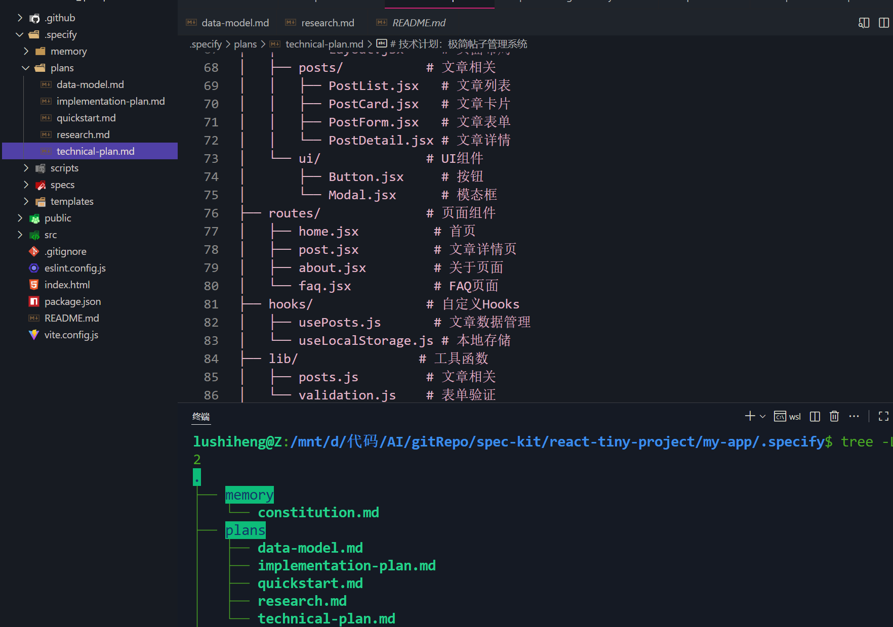

# 使用speckit.plan
```markdown
按照 speckit.plan.prompt.md 中的说明操作。

使用之前生成的规范：`.specify/specs/post-management-system.md`。

我希望您生成一份**技术计划**，以使用 **Vite + React + TailwindCSS + React Router v6** 实现此规范。

### 上下文
- 这是一个**极简的纯前端**项目。
- 没有后端 — 所有数据都模拟或存储在 `localStorage` 中。
- 代码必须遵循宪法原则：简洁、模块化、可读性、最小依赖、样式一致。

### 预期输出
制定一份完整的**实施计划**，包括：

1. **项目结构** — 文件夹、关键文件及其职责。
2. **路由设计** — 路由列表及其映射的组件。
3. **核心组件** — 它们的用途和属性。
4. **数据管理** — 如何存储、添加和删除帖子（模拟数据 + localStorage 持久化）。
5. **UI 设计指南** — 使用 TailwindCSS。
6. **实施顺序** — 首先构建什么，逐步说明（从设置 → UI → 路由 → 功能）。
7. **风险或权衡** — 可选。

保持简洁但完整 — 以便我可以按照它开始实施。
```


# 创建的是plans
