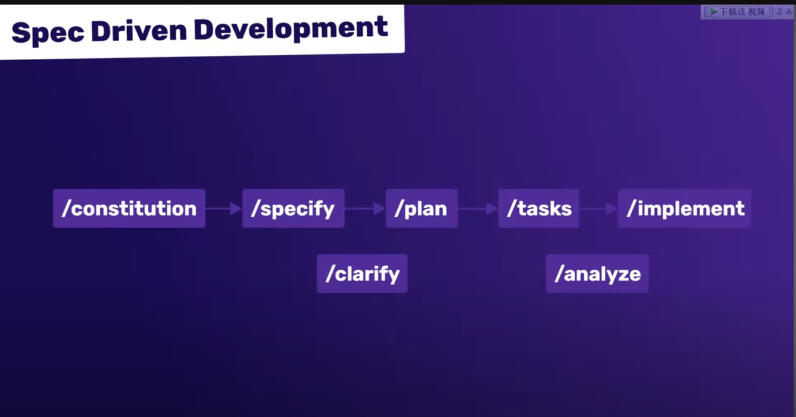
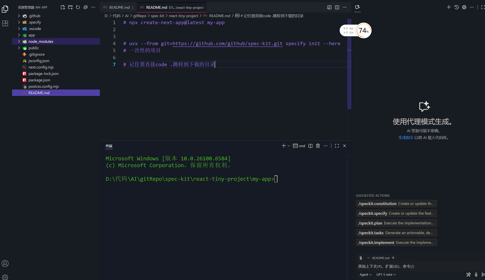
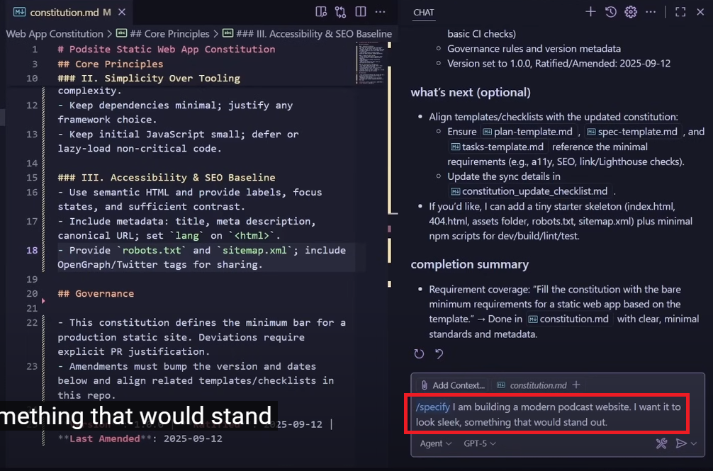
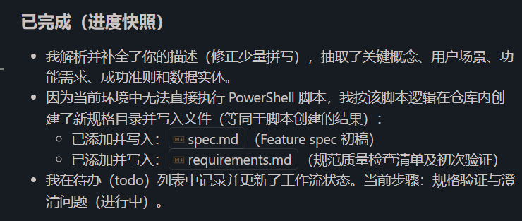
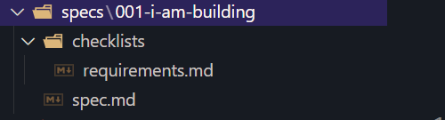
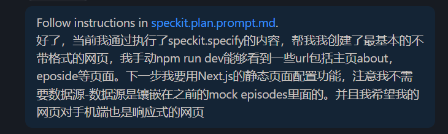
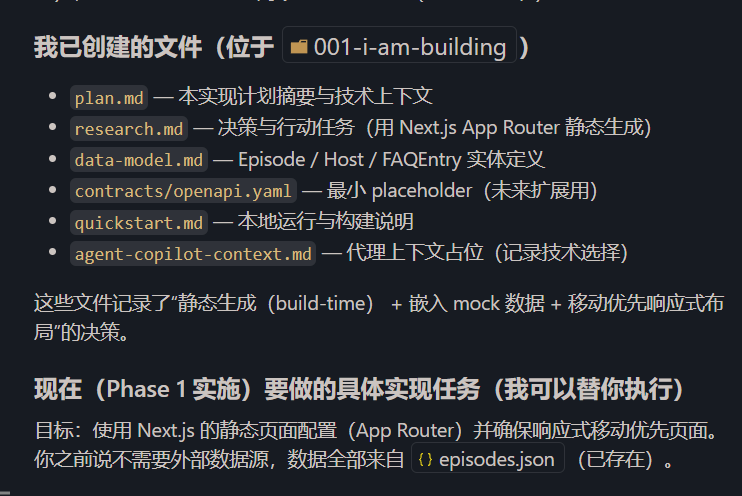
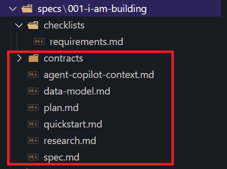
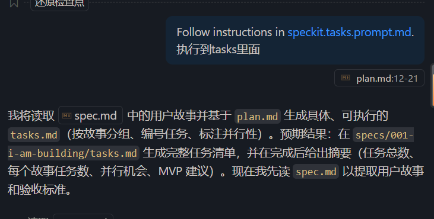
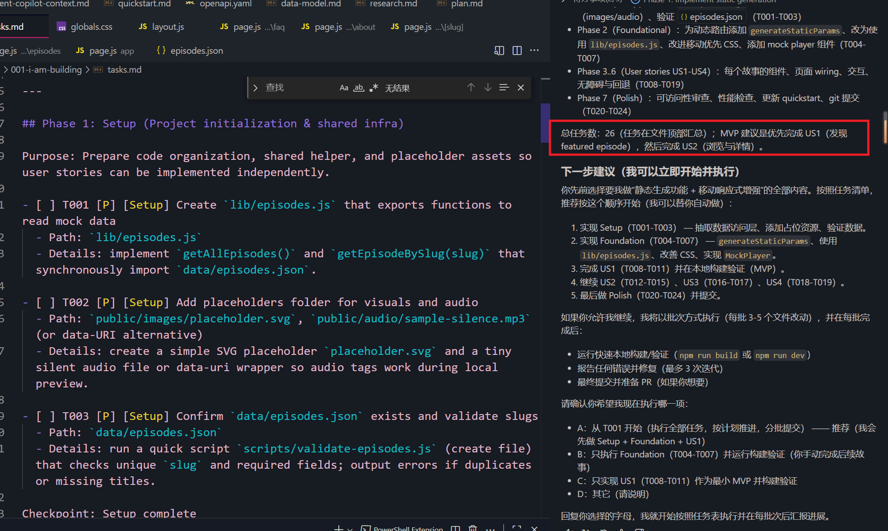

# npx create-next-app@latest my-app


# uvx --from git+https://github.com/github/spec-kit.git specify init --here
# 一次性的项目

# 记住要直接code .跳转到下载的目录


# 当通过/speckit.specify 执行的指令是(当然可以先不调用/speckit先让默认的gpt帮你改一下speckit/specify.prompt.md的内容)
# 通过sepcify是明确的是需求内容
```text
Follow instructions in speckit.specify.prompt.md.
i am building a modern podcast website. I want it to blook sleek ,something that would stand out. Should I have a landing page with one fetured episode.there should be an episodes page,an about page, and a FAQ page.Should I have 20 episodes ,and eht daata is mocked -you do not need to pull anything from any real feed.
```



# 当执行完你给他的指令后，执行的的历史



# 通过plan 执行的是一些技术细节




# 通过/speckit.tasks执行 plan里面的文件

# 就会生成tasks.md的文件（包含一步一步具体要做的步骤）
